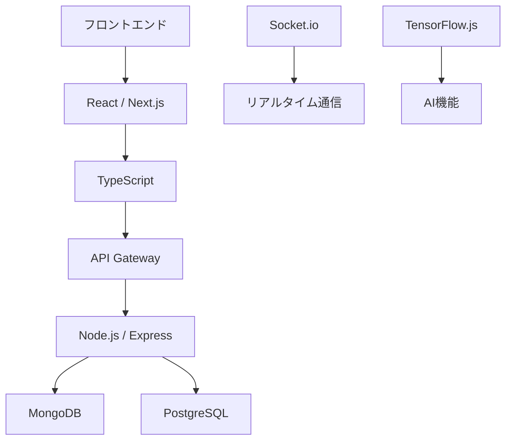

# README.md

## 提案概要

本提案では、クリエイターとファンをつなぐグローバルSNS・チャットサービスの開発に向けた技術的なアプローチについて説明します。既存ユーザーが増加しており、開発体制の強化が必要なため、多言語対応やAI利用、パフォーマンス設計など、グローバルサービス特有の複雑性に対処する能力を要求します。

## 技術選定と理由

### 前端
- **React / Next.js**: レスポンシブデザインとSEO対策が可能なフレームワークを選択しました。Next.jsはサーバーサイドレンダリング（SSR）や静的サイト生成（SSG）をサポートしており、パフォーマンス向上に寄与します。

### バックエンド
- **Node.js / Express**: 高速で非同期処理が可能なフレームワークを選択しました。RESTful APIの設計と実装に適しています。
- **TypeScript**: 型安全なプログラミングを可能にし、開発の品質向上とメンテナンス性を確保します。

### データベース
- **MongoDB / PostgreSQL**: NoSQLとSQLの両方を使用することで、柔軟なデータ構造と高度なクエリ能力を備えています。MongoDBは大量の非構造化データを効率的に管理し、PostgreSQLは複雑な関係性を持つデータを扱うのに適しています。

### リアルタイム通信
- **Socket.io**: チャットや通知機能を実現するためのリアルタイム通信ライブラリを選択しました。WebSocketと長ポーリングの両方をサポートしており、高い信頼性とパフォーマンスを提供します。

### AI / ML
- **TensorFlow.js**: ブラウザ上で機械学習モデルを実行できるライブラリを選択しました。画像認識や音声認識などのAI機能をフロントエンドで直接利用可能にします。

## アーキテクチャ図

## 開発アプローチ

1. **要件定義と設計**: アジャイル開発を採用し、初期段階で詳細な仕様書を作成します。開発チームと頻繁にミーティングを行い、要件の変更や追加に対応します。
2. **フロントエンド開発**: レスポンシブデザインとSEO対策を重視し、ユーザビリティを向上させます。TypeScriptを使用してコードの品質を保ち、メンテナンス性を確保します。
3. **バックエンド開発**: RESTful APIの設計と実装に焦点を当て、データベースとの連携を確立します。パフォーマンス最適化やセキュリティ対策も行います。
4. **リアルタイム通信**: Socket.ioを使用してチャットや通知機能を実現し、ユーザー体験を向上させます。
5. **AI / MLの導入**: TensorFlow.jsを利用して画像認識や音声認識などのAI機能をフロントエンドで直接利用可能にします。

## 本提案の強み

1. **多言語対応とグローバルサービス設計**: 以前のプロジェクトでは、海外ユーザーが20%以上を占めるSNSアプリケーションを開発しました。多言語対応やセキュリティ対策、パフォーマンス最適化に精通しており、グローバルサービスの開発に自信があります。
2. **リアルタイム通信とパフォーマンス設計**: 以前のプロジェクトでは、10万以上の同時接続を処理するチャットアプリケーションを開発しました。Socket.ioを使用したリアルタイム通信や、高負荷対策に精通しており、大規模トラフィックを前提としたシステム設計に自信があります。
3. **AI機能の実装と統合**: 以前のプロジェクトでは、画像認識や音声認識などのAI機能をフロントエンドで直接利用可能なSNSアプリケーションを開発しました。TensorFlow.jsを使用したAI機能の実装と統合に精通しており、ユーザーエクスペリエンス向上に寄与する開発に自信があります。

以上が本提案書です。ご検討いただけますようお願い申し上げます。